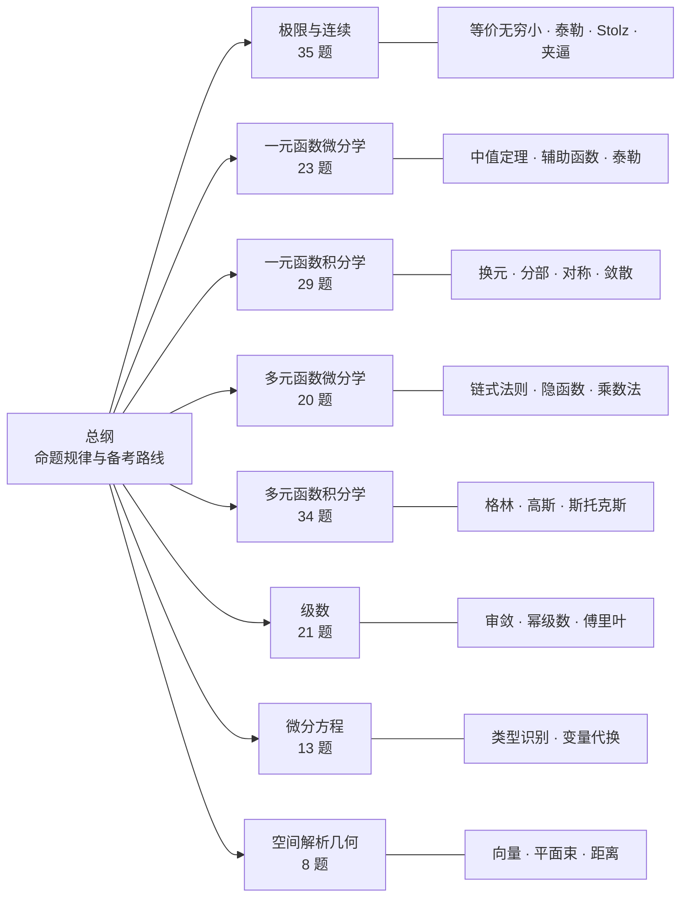

# 全国大学生数学竞赛（非数学类）备考指南


> **这不是题库。这是一份「考点地图 + 解题方法论」。**
>
> 基于第 1—17 届**全国大学生数学竞赛初赛（非数学类）**共 183 道真题的统计分析，
> 提炼出八大知识模块的**命题规律、方法体系、易错点清单与考点索引**。
>
> **本仓库不含任何试题原文与官方答案**，只记录"考什么、怎么考、怎么准备"。

---

## 为什么不含试题？

全国大学生数学竞赛由中国数学会主办，试题的复制权、发行权、信息网络传播权
**已独家授权给出版方**，官方也发行了权威的试题汇编与参考答案。

因此把真题全文或详解搬到公开仓库，会与权利方的正当权益直接冲突。
本仓库换了一个思路：**只输出"关于题目的元信息"**——

| 保留（原创/统计性内容） | 不保留 |
|--------------------------|--------|
| 命题规律、模块权重、届次分布 | 试题题干原文 |
| 方法体系、解题套路、工具箱 | 官方参考答案原文 |
| 易错点清单、考场策略 | 逐题详解 |
| 考点索引（届次 / 题号 / 方法 / 难度） | —— |

这样既完全避开了试题文本的复制，也保留了绝大部分备考价值——
**真正稀缺的不是题目（官方渠道都有），而是"题目的组织方式与解题决策逻辑"。**

获取真题与官方答案，请访问中国数学会竞赛官方渠道。

---

## 目录

| 文件 | 内容 |
|------|------|
| **[00-总纲-命题规律与备考路线](00-总纲-命题规律与备考路线.md)** | 全局权重、跨模块方法 TOP10、三轮复习路线、考场策略、**先读这篇** |
| **[01-极限与连续](01-极限与连续.md)** | 35 题 · 9 大方法 · 填空主战场 |
| **[02-一元函数微分学](02-一元函数微分学.md)** | 23 题 · 中值定理与辅助函数构造 |
| **[03-一元函数积分学](03-一元函数积分学.md)** | 29 题 · 届届必考 · 换元/分部/对称/敛散 |
| **[04-多元函数微分学](04-多元函数微分学.md)** | 20 题 · 链式法则 / 隐函数 / 条件极值 |
| **[05-多元函数积分学](05-多元函数积分学.md)** | 34 题 · 三大公式 / 坐标变换 / 对称性 |
| **[06-级数](06-级数.md)** | 21 题 · 敛散判别 / 幂级数求和 / 傅里叶 |
| **[07-微分方程](07-微分方程.md)** | 13 题 · 类型识别 / 变量代换 / 解的结构 |
| **[08-空间解析几何](08-空间解析几何.md)** | 8 题 · 向量代数 / 平面束 / 距离公式 |

---

## 知识模块权重（183 题统计）

| 模块 | 题量 | 占比 | 填空 | 解答 | 覆盖届次 |
|------|:----:|:----:|:----:|:----:|:--------:|
| 极限与连续 | 35 | 19.1% | 28 | 7 | 16 / 17 |
| 多元函数积分学 | 34 | 18.6% | 20 | 14 | **17 / 17** |
| 一元函数积分学 | 29 | 15.8% | 15 | 14 | **17 / 17** |
| 一元函数微分学 | 23 | 12.6% | 12 | 11 | 13 / 17 |
| 级数 | 21 | 11.5% | 10 | 11 | 16 / 17 |
| 多元函数微分学 | 20 | 10.9% | 14 | 6 | 15 / 17 |
| 微分方程 | 13 | 7.1% | 6 | 7 | 11 / 17 |
| 空间解析几何 | 8 | 4.4% | 6 | 2 | 8 / 17 |

**总计 183 题 = 填空 111 + 解答 72**



---

## 怎么读

### 在 GitHub 上

直接点击上方表格中的链接即可跳转。公式由 MathJax 渲染，Obsidian 的 callout
（`> [!abstract]` 等）会降级为普通引用块，不影响阅读。
建议先读 `00-总纲`，再按薄弱模块选读分册。

### 在 Obsidian 中（推荐）

```bash
git clone https://github.com/Kael-z-dev/cmc-calculus-prep-guide.git
```

然后用 Obsidian「打开文件夹作为库」选中该目录即可。
此时 callout 会渲染为彩色语义块，frontmatter 的 `tags` / `aliases` 也能被
Dataview、标签面板和搜索正常识别。

---

## 笔记的可靠性

- 统计口径：第 1—17 届初赛（非数学类），含第 14 届第二次补赛，共 183 题。
- 方法体系与易错点为通用数学方法的归纳总结，属**原创性内容**。
- 考点索引中的"届次 / 题号 / 难度"为统计与判断结果，难度为相对标注，非官方评级。
- 若发现归类或方法描述有误，欢迎提 Issue 或 PR。

---

## 版权与许可

- **本仓库的文本内容**（方法体系、规律分析、索引与策略）为原创整理，
  采用 [**CC BY-NC-SA 4.0**](https://creativecommons.org/licenses/by-nc-sa/4.0/) 许可：
  署名 · 非商业 · 相同方式共享。
- **试题本身**的版权归**中国数学会**及其授权方所有。本仓库**不包含试题原文**，
  也不主张对试题的任何权利。
- 本笔记仅供学习交流，不作为任何商业用途。若您是相关权利方且认为本仓库内容
  需要调整，请通过 Issue 联系，会第一时间处理。

---

<sub>最后更新：2026-09 · 统计口径：第 1—17 届全国大学生数学竞赛初赛（非数学类）</sub>
